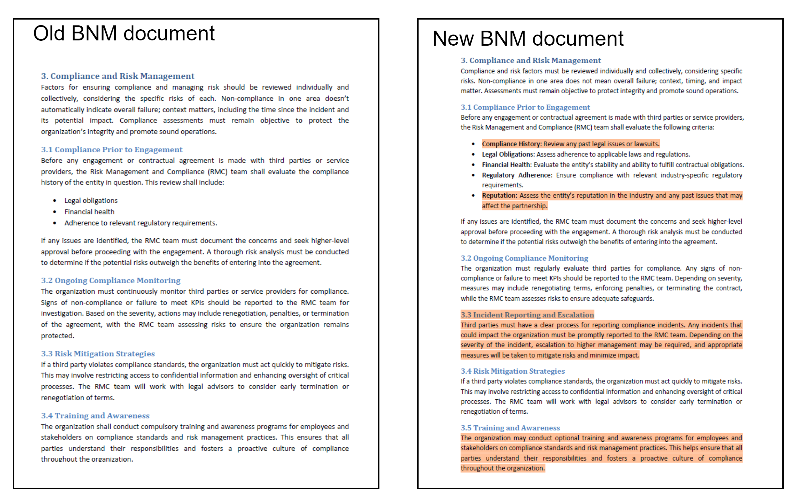
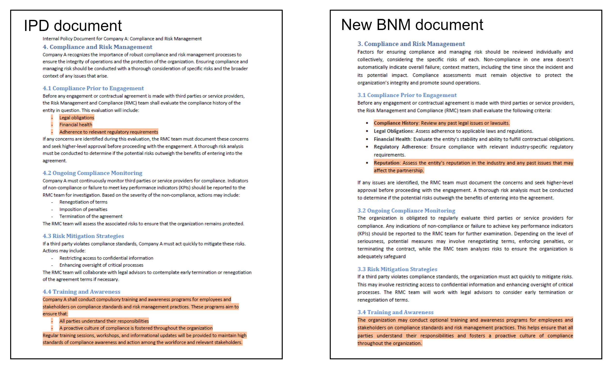

# AI-Tinkerers-KL-4

# AI for Regulatory Compliance in Financial Institutions

## Background
The financial sector in Malaysia operates under a strict regulatory framework established by Bank Negara Malaysia (BNM). Each financial institution has developed a comprehensive set of internal procedures and policies to ensure compliance with BNM’s evolving guidelines. However, when BNM releases revisions to its policy documents, the manual process of reviewing, identifying changes, and assessing their impact on internal procedures is labor-intensive, time-consuming, and potentially prone to human error. We think this is the perfect problem space for applying a large language model technology that is inherently good at understanding and working with natural language within the documents.  

## Problem Statement
Whenever BNM releases new or updated policy documents, financial institutions must:

1. **Identify Changes**: Accurately detect all new additions, modifications, or removals within the revised policy documents.
2. **Assess Impact**: Understand how these changes affect existing internal policies and procedures within the financial institution.

This manual process requires a team of personnel to carefully comb through extensive documents, which is resource-intensive and subject to oversight, potentially leading to compliance gaps or delays in policy updates.

## Hackathon Challenge
The participants' goal is to develop an AI-driven solution that automates and optimizes this process. The AI system should be able to:

1. **Identify Changes**: Automatically detect additions, modifications, or removals in revised BNM policy documents by comparing the latest versions with previous ones.
2. **Assess Impact**: Analyze the detected changes and evaluate their potential impact on the internal procedures and policies of financial institutions. The solution should provide clear, actionable insights into how internal documents need to be updated to maintain compliance.

## Evaluation Criteria
Provided with a set of BNM policy documents and their corresponding revisions, each solution will be evaluated against the following areas:

1. **Quantitative**: F1 score for the changes identified between the revisions of each BNM policy document.
2. **Quantitative**: F1 score for the impacted areas identified on the internal procedures and policies.
3. **Qualitative**: Applicability and relevance of the actionable insights provided.
   - **Score 0**: No Applicability
     - None of the actionable insights are relevant to the changes identified.
   - **Score 1**: Moderate Applicability
     - Only partial actionable insights are relevant to the changes identified.
   - **Score 2**: High Applicability
     - All the actionable insights are relevant to the changes identified.
4. **Qualitative**: Creativity of the solution.

Ensuring fairness and consistency in the evaluation, the same set of internal procedures and policies will be used for the evaluation of all solutions.

## Expected Outcome
By the end of the hackathon, participants will showcase AI solutions capable of streamlining the policy review process, enhancing efficiency, reducing human error, and ensuring that financial institutions in Malaysia stay up-to-date with BNM’s regulatory revisions in a timely and accurate manner.

## Key Deliverables
1. **Change Detection Algorithm**: A robust mechanism to detect document revisions, highlighting any additions, deletions, or modifications.
2. **Impact Analysis Tool**: A system that can map policy changes to corresponding internal procedures and suggest necessary updates.
3. **User Interface**: A dashboard or report generation system that presents findings and suggestions in a user-friendly manner.

This hackathon is an exciting opportunity for teams to apply cutting-edge AI technologies to a real-world challenge, ultimately contributing to the financial sector’s compliance and operational efficiency. 

### Submission
Fork this repository and submit your solution through your own fork.

# Examples
This section provides an example of the expected outcomes.

**Goal 1: Identifying Changes**

The first challenge requires the solution to automatically detect additions, modifications, or deletions by comparing two versions of a regulatory policy document. The output should focus on identifying changes in semantic meaning. The output may consist of numeric or descriptive answers, with the **section numbers being a mandatory output**. Please refer to the example output shown in the table below for guidance.

<table>
    <tr>
        <th>No</th>
        <th>Affected Section</th>
        <th>Summary of Impact</th>
    </tr>
   <tr>
      <td>1</td>
      <td>3.1 / Section 3.1</td>
      <td>
        The following additions have been made in the updated version of the document:
          
        1. Compliance History: A new criterion has been added to review any past legal issues or lawsuits related to the entity.
         
        2. Reputation: A new section has been introduced to assess the entity’s reputation in the industry and any past issues that could affect the partnership.
          
        Both of these points were not present in the original version.
      </td>
    </tr>
    <tr>
      <td>2</td>
      <td>3.3 / Paragraph 3.3</td>
      <td>A new section, 'Incident Reporting and Escalation,' is added.</td>
    </tr>
    <tr>
      <td>3</td>
      <td>
        <b>Based on old policy document:</b> 3.4 / 3.4 Training and Awareness
          
        <b>Based on new policy document:</b> 3.5 / 3.5 Training and Awareness
        </td>
      <td>The section number has been moved from 3.4 to 3.5 due to the addition of a new section (3.3). The training and awareness program has been changed to optional.</td>
    </tr>
</table>

Notes 
1) It does not matter whether the old or new policy document is used as the point of reference in identifying updated section(s), as illustrated in the example above.
2) The renumbering of "Risk Mitigation Strategies" from 3.3 in the old policy document to 3.4 in the new policy document is not included as a change because there is no change in any semantics meaning.

**Goal 2: Assess Impact**

The second challenge requires the solution to analyze the identified changes from the regulatory policy documents and assess their potential impact on the internal policy/procedure documents (IPDs) of the financial institution. The output should focus on identifying the affected section within the IPDs along with a summary of impacts on the IPDs. Please refer to the example output provided in the table below for guidance.

<table>
    <tr>
        <th>No</th>
        <th>Affected Section</th>
        <th>Summary of Impact</th>
    </tr>
    <tr>
        <td>1</td>
        <td>4.1</td>
        <td>The new policy (section 3.1) introduces several new criteria and adjustments compared to the current policy document(section 4.1). Here's a summary of the impacts:

**Compliance History (New in 3.1)**
- **Impact:** The updated policy now requires a review of past legal issues or lawsuits, adding an extra layer of diligence which will necessitate additional legal checks and documentation.

**Reputation (New in 3.1)**
- **Impact:** The updated policy mandates assessing the entity’s reputation in the industry and any past issues that could affect the partnership; compliance will require implementing a process for evaluating reputation, likely involving public records or third-party assessments.</td>
    </tr>
    <tr>
        <td>2</td>
        <td>4.4 Training and Awareness</td>
        <td>The company now has the option to decide whether to implement a training and awareness program or not.</td>
    </tr>
</table>

# Sample Policy Documents
The sample policy documents can be found within the `samples` folder:

1) `regulatory_policy_documents`: contains samples of BNM policy documents
2) `internal_policy_documents`: contains samples of internal policy documents of a financial institution

Additional samples may be provided as needed.